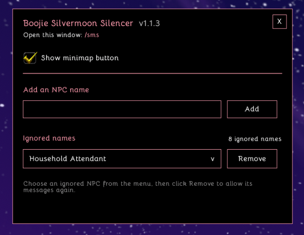

# Boojie Silvermoon Silencer

Boojie Silvermoon Silencer hides chat messages from selected Silvermoon NPCs in World of Warcraft.

## Features

- Filters chat messages by exact NPC sender name
- Includes Household Attendant, Silvermoon Attendant, Silvermoon Noble, Silvermoon Resident, and Silvermoon Truthsayer by default
- Add and remove NPC names from a saved ignore list
- Movable Boojie-style settings window
- LibDataBroker minimap button with a visibility setting
- Imports the legacy Silvermoon Silencer database when available

## Important

The filter only hides messages whose sender exactly matches a name in the saved list. It does not modify or delete Blizzard chat data.

## Settings

Open Settings with the minimap button or `/sms`.

You can add NPC names, select and remove saved names, and show or hide the minimap button.

## Installation

1. Download the zip file and unarchive it.
2. Place the `BoojieSilvermoonSilencer` folder inside:

   `World of Warcraft/_retail_/Interface/AddOns/`

3. Ensure it is properly installed by checking:

   `World of Warcraft/_retail_/Interface/AddOns/BoojieSilvermoonSilencer/BoojieSilvermoonSilencer.toc`

4. Enable Boojie Silvermoon Silencer from the AddOns menu on the character-selection screen.
5. Log in or type `/reload`.

## Author

Created by **BoojiePanda (SilverRavyn)**.
